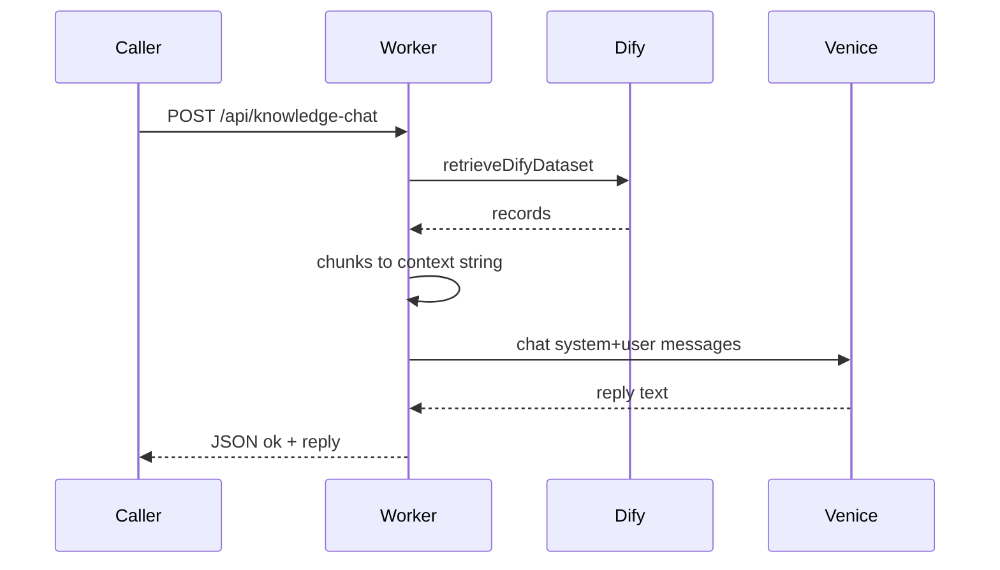

# Консультант по базе знаний (Dify → LLM)

## Поведение

1. **`retrieveDifyDataset`** из [`src/difyRetrieve.ts`](d:/GitHub/TaskBoardFornBack/aiboardBackend/aiboard/src/difyRetrieve.ts) — уже учитывает `economy` и `retrieval_model_dict`.
2. Собрать из `records[].segment` текст для промпта: `content` / `answer`, при наличии — имя документа из `segment.document?.name`. Нумерация фрагментов, разделители между чанками.
3. **Ограничение длины контекста** (например обрезка по суммарному числу символов ~12–16k), чтобы не раздувать запрос к Venice.
4. **`sendLlmRequest`** из [`src/llm.ts`](d:/GitHub/TaskBoardFornBack/aiboardBackend/aiboard/src/llm.ts): два сообщения — **system** с фиксированным текстом (строго по вашей формулировке), **user** с вопросом и блоком «Контекст из базы знаний: …» (или пустой контекст, если `records` нет — модель по промпту должна не выдумывать).

**Системный промпт (как вы указали, дословно):**  
`Ты консультат по сайту AI Board. Отвечай на вопросы строго по базе знаний`

(опечатка «консультат» сохраняется по вашему тексту; при желании потом замените на «консультант».)

## Новый файл

[`src/knowledgeConsultant.ts`](d:/GitHub/TaskBoardFornBack/aiboardBackend/aiboard/src/knowledgeConsultant.ts) (имя можно чуть сократить, но смысл тот же):

- Константа `KNOWLEDGE_CONSULTANT_SYSTEM_PROMPT`.
- Внутренняя функция `buildContextFromRecords(records: DifyRetrieveRecord[] | undefined): string`.
- Экспорт **`consultWithKnowledgeBase(env, { datasetId, userQuestion, model?, retrieveOptions? })`**:  
  - `env`: `Pick<Env, "VENICE_API_KEY" | "DIFY_DATASET_API_KEY">` + опционально `DIFY_API_BASE` (как у Dify).  
  - Возвращает `Promise<string>` (финальный ответ модели).

## HTTP-маршрут

В [`src/index.ts`](d:/GitHub/TaskBoardFornBack/aiboardBackend/aiboard/src/index.ts) после существующих `/api/dify/*` (паттерн `jsonWithCors`, обработка ошибок как у `/api/chat`):

- **`POST /api/knowledge-chat`**
- Тело JSON: `query` (обязательно), `dataset_id` (опционально, если задан дефолт в env — см. ниже), `model` (опционально).
- Ответ: `{ ok: true, reply: string }` или `{ ok: false, error: string }` с 4xx/500.

## Переменные окружения (опционально)

В [`src/env.d.ts`](d:/GitHub/TaskBoardFornBack/aiboardBackend/aiboard/src/env.d.ts):

- **`DIFY_KNOWLEDGE_DATASET_ID?: string`** — UUID базы по умолчанию, чтобы в Postman/UI передавать только `query`. Если в теле есть `dataset_id`, он имеет приоритет; если оба отсутствуют — `400` с понятным сообщением.

## Зависимости

- Импорт типов `DifyRetrieveRecord` из `difyRetrieve` (экспортировать при необходимости, если сейчас не экспортируется — проверить; при необходимости передавать только `DifyRetrieveResponse` и типизировать внутри).

## Проверка

- Локально: `POST http://localhost:8787/api/knowledge-chat` с `query` и `dataset_id` (или только `query`, если задан секрет/default в `.dev.vars`).
- `tsc --noEmit`, при необходимости `wrangler deploy` после вашего подтверждения плана.
